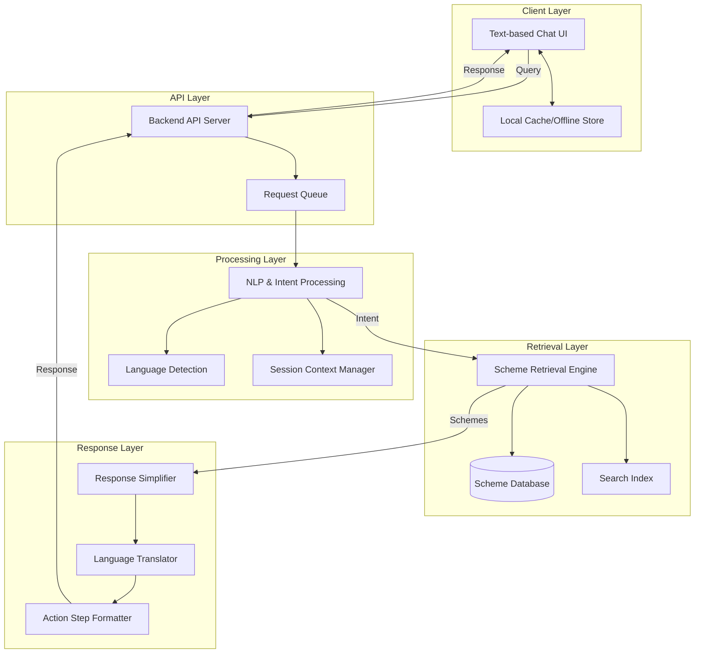

# Design Document: Local Language Assistant

## Overview

This document describes the technical design for a conversational AI assistant that helps underserved communities access government scheme information. The system prioritizes low-bandwidth operation, multi-language support, and actionable responses.

The architecture follows a layered approach with clear separation between the user interface, API processing, NLP/intent handling, scheme retrieval, and response generation. All components are optimized for minimal data transfer and graceful degradation on unreliable networks.

## Architecture



### Component Responsibilities

1. **Client Layer**: Lightweight text interface with local caching for offline resilience
2. **API Layer**: Request handling, queuing for network resilience, response delivery
3. **Processing Layer**: Language detection, intent extraction, session management
4. **Retrieval Layer**: Scheme matching, relevance ranking, database queries
5. **Response Layer**: Simplification, translation, action step formatting

## Components and Interfaces

### 1. Query Processor

Handles incoming user queries, validates input, and prepares for NLP processing.

```python
from dataclasses import dataclass
from typing import Optional
from enum import Enum

class QueryStatus(Enum):
    VALID = "valid"
    EMPTY = "empty"
    TRUNCATED = "truncated"

@dataclass
class ProcessedQuery:
    original_text: str
    normalized_text: str
    status: QueryStatus
    detected_language: Optional[str]
    character_count: int

class QueryProcessor:
    MAX_QUERY_LENGTH = 500
    
    def process(self, raw_query: str) -> ProcessedQuery:
        """
        Process and validate incoming query.
        - Strips whitespace
        - Truncates to MAX_QUERY_LENGTH
        - Normalizes text for NLP processing
        """
        pass
    
    def is_valid(self, query: str) -> bool:
        """Check if query contains meaningful content."""
        pass
```

### 2. Language Detector

Identifies the language of user input and manages language preferences.

```python
from dataclasses import dataclass
from typing import List

SUPPORTED_LANGUAGES = ["hi", "ta", "te", "bn", "mr"]  # Hindi, Tamil, Telugu, Bengali, Marathi

@dataclass
class LanguageDetectionResult:
    detected_language: str
    confidence: float
    is_confident: bool  # True if confidence > 0.7

class LanguageDetector:
    CONFIDENCE_THRESHOLD = 0.7
    DEFAULT_LANGUAGE = "hi"  # Hindi as fallback
    
    def detect(self, text: str) -> LanguageDetectionResult:
        """
        Detect language from text.
        Returns detection result with confidence score.
        """
        pass
    
    def is_supported(self, language_code: str) -> bool:
        """Check if language is in supported list."""
        pass
```

### 3. Intent Extractor

Extracts user intent and entities from the processed query.

```python
from dataclasses import dataclass
from typing import List, Dict, Optional
from enum import Enum

class IntentType(Enum):
    FIND_SCHEME = "find_scheme"
    SCHEME_DETAILS = "scheme_details"
    ELIGIBILITY_CHECK = "eligibility_check"
    APPLICATION_STEPS = "application_steps"
    CLARIFICATION = "clarification"
    LANGUAGE_CHANGE = "language_change"
    UNKNOWN = "unknown"

@dataclass
class ExtractedIntent:
    intent_type: IntentType
    confidence: float
    entities: Dict[str, str]  # e.g., {"category": "education", "age": "18"}
    referenced_scheme_id: Optional[str]  # For follow-up questions

class IntentExtractor:
    def extract(self, query: ProcessedQuery, session_context: 'SessionContext') -> ExtractedIntent:
        """
        Extract intent and entities from query.
        Uses session context to resolve references.
        """
        pass
```

### 4. Session Context Manager

Maintains conversation state within a session.

```python
from dataclasses import dataclass, field
from typing import List, Optional
from datetime import datetime

@dataclass
class SessionContext:
    session_id: str
    language: str
    last_activity: datetime
    mentioned_schemes: List[str] = field(default_factory=list)
    conversation_history: List[Dict] = field(default_factory=list)
    user_attributes: Dict[str, str] = field(default_factory=dict)  # Non-PII attributes like "category: farmer"

class SessionManager:
    SESSION_TIMEOUT_MINUTES = 30
    MAX_HISTORY_LENGTH = 10
    
    def get_or_create(self, session_id: str) -> SessionContext:
        """Get existing session or create new one."""
        pass
    
    def update(self, session: SessionContext, query: str, response: str, schemes: List[str]) -> None:
        """Update session with new interaction."""
        pass
    
    def is_expired(self, session: SessionContext) -> bool:
        """Check if session has timed out."""
        pass
    
    def resolve_reference(self, session: SessionContext, reference: str) -> Optional[str]:
        """Resolve pronoun or short reference to scheme ID."""
        pass
```

### 5. Scheme Retrieval Engine

Searches and ranks schemes based on user query and context.

```python
from dataclasses import dataclass
from typing import List, Optional

@dataclass
class Scheme:
    scheme_id: str
    name: Dict[str, str]  # Localized names: {"hi": "...", "en": "..."}
    description: Dict[str, str]  # Localized descriptions
    category: str
    eligibility_criteria: List[str]
    required_documents: List[str]
    application_steps: List[str]
    contact_office: str
    keywords: List[str]

@dataclass
class SchemeMatch:
    scheme: Scheme
    relevance_score: float
    matched_criteria: List[str]

class SchemeRetriever:
    MAX_RESULTS = 3
    
    def search(self, intent: ExtractedIntent, language: str) -> List[SchemeMatch]:
        """
        Search schemes matching the intent.
        Returns top MAX_RESULTS ranked by relevance.
        """
        pass
    
    def get_by_id(self, scheme_id: str) -> Optional[Scheme]:
        """Retrieve specific scheme by ID."""
        pass
    
    def get_related_categories(self, category: str) -> List[str]:
        """Get related categories for suggestions when no match found."""
        pass
```

### 6. Response Generator

Creates simplified, actionable responses in the user's language.

```python
from dataclasses import dataclass
from typing import List, Optional

@dataclass
class ActionStep:
    step_number: int
    instruction: str
    location: Optional[str]  # e.g., "Gram Panchayat office"
    documents: List[str]

@dataclass
class AssistantResponse:
    message: str
    action_steps: List[ActionStep]
    schemes_mentioned: List[str]
    has_more: bool  # True if response was split
    language: str
    byte_size: int

class ResponseGenerator:
    MAX_RESPONSE_WORDS = 200
    MAX_RESPONSE_BYTES = 10240  # 10 KB
    MAX_ACTION_STEPS = 5
    
    def generate(
        self,
        schemes: List[SchemeMatch],
        intent: ExtractedIntent,
        language: str,
        session: SessionContext
    ) -> AssistantResponse:
        """
        Generate simplified response with action steps.
        Ensures response is under size limits.
        """
        pass
    
    def simplify_text(self, text: str, language: str) -> str:
        """
        Simplify text to 5th grade reading level.
        Uses simple vocabulary and short sentences.
        """
        pass
    
    def format_action_steps(self, steps: List[str], language: str) -> List[ActionStep]:
        """Format steps as numbered list with locations and documents."""
        pass
```

### 7. API Handler

Main entry point handling requests and responses.

```python
from dataclasses import dataclass
from typing import Optional
from enum import Enum

class ResponseStatus(Enum):
    SUCCESS = "success"
    ERROR = "error"
    SESSION_EXPIRED = "session_expired"
    RETRY = "retry"

@dataclass
class APIRequest:
    session_id: str
    query: str
    preferred_language: Optional[str]

@dataclass
class APIResponse:
    status: ResponseStatus
    response: Optional[AssistantResponse]
    error_message: Optional[str]
    session_id: str

class APIHandler:
    MAX_RETRIES = 2
    TIMEOUT_SECONDS = 5
    
    def handle_query(self, request: APIRequest) -> APIResponse:
        """
        Main entry point for processing queries.
        Orchestrates all components and handles errors.
        """
        pass
    
    def handle_error(self, error: Exception, language: str) -> APIResponse:
        """Generate user-friendly error response."""
        pass
```

## Data Models

### Scheme Database Schema

```python
@dataclass
class SchemeRecord:
    """Database record for a government scheme."""
    scheme_id: str
    
    # Localized content (key = language code)
    names: Dict[str, str]
    descriptions: Dict[str, str]
    eligibility_text: Dict[str, List[str]]
    steps_text: Dict[str, List[str]]
    
    # Metadata
    category: str  # e.g., "education", "healthcare", "financial_aid"
    subcategory: str
    target_demographics: List[str]  # e.g., ["farmer", "student", "senior_citizen"]
    
    # Requirements
    required_documents: List[str]
    eligibility_criteria: Dict[str, any]  # Structured criteria for matching
    
    # Contact
    contact_office_type: str  # e.g., "Gram Panchayat", "Block Office"
    helpline_number: Optional[str]
    
    # Search optimization
    keywords: Dict[str, List[str]]  # Localized keywords
    
    # Status
    is_active: bool
    last_updated: datetime
```

### Session Storage Schema

```python
@dataclass
class SessionRecord:
    """Stored session data (no PII)."""
    session_id: str
    created_at: datetime
    last_activity: datetime
    language: str
    
    # Context (no personal information)
    mentioned_scheme_ids: List[str]
    user_category: Optional[str]  # e.g., "farmer", "student"
    conversation_turns: int
    
    # Compressed history (last N turns only)
    recent_intents: List[str]
```

### Request/Response Payloads

```python
@dataclass
class QueryPayload:
    """Incoming request payload - optimized for size."""
    q: str  # Query text
    s: str  # Session ID
    l: Optional[str] = None  # Preferred language (optional)

@dataclass
class ResponsePayload:
    """Outgoing response payload - optimized for size."""
    m: str  # Message
    a: Optional[List[Dict]] = None  # Action steps
    n: bool = False  # Has more (next)
    e: Optional[str] = None  # Error code
```


## Correctness Properties

*A property is a characteristic or behavior that should hold true across all valid executions of a system—essentially, a formal statement about what the system should do. Properties serve as the bridge between human-readable specifications and machine-verifiable correctness guarantees.*

### Property 1: Query Validation Rejects Invalid Input

*For any* string composed entirely of whitespace characters (spaces, tabs, newlines), the QueryProcessor SHALL reject it and return a status of EMPTY, leaving the system state unchanged.

**Validates: Requirements 1.4**

### Property 2: Query Truncation Preserves Prefix

*For any* query string longer than 500 characters, the QueryProcessor SHALL return a ProcessedQuery where the normalized_text contains exactly the first 500 characters of the original, and the status is TRUNCATED.

**Validates: Requirements 1.5**

### Property 3: Language Detection Consistency

*For any* text input in a supported language, the LanguageDetector SHALL detect the language, and the ResponseGenerator SHALL produce a response in that same detected language.

**Validates: Requirements 2.2, 2.3**

### Property 4: Language Switch Persistence

*For any* session where a user requests a language change, all subsequent responses in that session SHALL be in the newly requested language until another change is requested.

**Validates: Requirements 2.4**

### Property 5: Low Confidence Language Fallback

*For any* text where language detection confidence is below the threshold (0.7), the Assistant SHALL respond with a language clarification prompt and default to Hindi.

**Validates: Requirements 2.5, 7.2**

### Property 6: Search Results Bounded and Ranked

*For any* search query that matches N schemes in the database (where N > 0), the SchemeRetriever SHALL return at most 3 schemes, and those schemes SHALL be ordered by descending relevance score.

**Validates: Requirements 3.2, 3.6**

### Property 7: Scheme Response Completeness

*For any* scheme included in a response, the response message SHALL contain the scheme name, a description, and at least one eligibility criterion in the user's language.

**Validates: Requirements 3.3**

### Property 8: Empty Results Provide Alternatives

*For any* search query that matches zero schemes, the response SHALL contain either related category suggestions or a clarifying question.

**Validates: Requirements 3.4**

### Property 9: Action Steps Formatting Invariants

*For any* response containing action steps: (a) there SHALL be at least 1 and at most 5 action steps, (b) steps SHALL be numbered sequentially starting from 1, (c) steps requiring a location SHALL specify the office type, and (d) steps requiring documents SHALL list those documents.

**Validates: Requirements 4.1, 4.2, 4.3, 4.4**

### Property 10: Long Process Pagination

*For any* scheme with more than 5 application steps, the response SHALL set has_more to true and include only the first 5 steps, with a prompt to continue.

**Validates: Requirements 4.6**

### Property 11: Response Size Constraints

*For any* generated response: (a) the word count SHALL be 200 or fewer, (b) the byte size SHALL be under 10,240 bytes, and (c) the response SHALL contain only text (no image URLs or rich media markers).

**Validates: Requirements 4.5, 5.1, 5.4**

### Property 12: Session Context Preservation

*For any* active session, scheme IDs mentioned in previous turns SHALL be stored in the session context, and references to "it", "this scheme", or the scheme's short name SHALL resolve to the correct scheme ID.

**Validates: Requirements 6.1, 6.2**

### Property 13: Session Expiration

*For any* session with last_activity older than 30 minutes, the SessionManager.is_expired() SHALL return true, and subsequent requests SHALL receive a session expired response with an offer to start new.

**Validates: Requirements 6.3, 6.4**

### Property 14: Session Privacy

*For any* SessionRecord, the stored data SHALL contain no personally identifiable information (no names, phone numbers, addresses, or government ID numbers).

**Validates: Requirements 6.5**

### Property 15: Error Message Localization

*For any* error condition, the error message returned to the user SHALL be in the user's session language and SHALL NOT contain technical terms, stack traces, or error codes.

**Validates: Requirements 7.3, 7.5**

### Property 16: Escalation After Failed Clarifications

*For any* session where the intent has been UNKNOWN for 2 consecutive turns, the response SHALL include a helpline number for human assistance.

**Validates: Requirements 7.4**

## Error Handling

### Error Categories

| Error Type | User Message | System Action |
|------------|--------------|---------------|
| Database Unavailable | "Service temporarily unavailable. Please try again in a few minutes." | Log error, return RETRY status |
| Language Detection Failed | "Which language would you prefer? Hindi/Tamil/Telugu/Bengali/Marathi" | Default to Hindi, prompt for confirmation |
| Intent Unknown | "I didn't understand. Could you rephrase your question?" | Increment clarification counter |
| Session Expired | "Your session has ended. Would you like to start a new conversation?" | Clear session, offer restart |
| Query Empty | "Please type your question to get started." | Return without processing |
| Network Timeout | "Connection slow. Retrying..." | Auto-retry up to 2 times |
| Unexpected Error | "Something went wrong. Please try again." | Log full error, return generic message |

### Error Response Format

```python
ERROR_MESSAGES = {
    "hi": {
        "db_unavailable": "सेवा अस्थायी रूप से अनुपलब्ध है। कृपया कुछ मिनटों में पुनः प्रयास करें।",
        "session_expired": "आपका सत्र समाप्त हो गया है। क्या आप नई बातचीत शुरू करना चाहेंगे?",
        "query_empty": "कृपया अपना प्रश्न टाइप करें।",
        "unknown_intent": "मुझे समझ नहीं आया। क्या आप दोबारा बता सकते हैं?",
        "helpline": "अधिक सहायता के लिए हेल्पलाइन पर कॉल करें: 1800-XXX-XXXX"
    },
    # Similar entries for ta, te, bn, mr
}
```

### Graceful Degradation Strategy

1. **Database Failure**: Return cached popular schemes if available, otherwise error message
2. **Language Service Failure**: Default to Hindi, continue processing
3. **Search Failure**: Suggest browsing by category instead of search
4. **Session Store Failure**: Process as stateless request, warn user context may be lost

## Testing Strategy

### Dual Testing Approach

This system requires both unit tests and property-based tests for comprehensive coverage:

- **Unit Tests**: Verify specific examples, edge cases, integration points, and error conditions
- **Property Tests**: Verify universal properties hold across all valid inputs using randomized testing

### Property-Based Testing Configuration

**Library**: Hypothesis (Python)

**Configuration**:
- Minimum 100 iterations per property test
- Each test tagged with feature and property reference
- Tag format: `@settings(max_examples=100)` with docstring containing `Feature: local-language-assistant, Property N: [description]`

### Test Categories

#### Unit Tests

1. **Query Processor**
   - Empty string returns EMPTY status
   - Whitespace-only string returns EMPTY status
   - Exactly 500 character string processes fully
   - 501 character string truncates to 500

2. **Language Detector**
   - Hindi text detected as "hi"
   - Tamil text detected as "ta"
   - Mixed language text returns low confidence

3. **Scheme Retriever**
   - Known scheme ID returns correct scheme
   - Non-existent ID returns None
   - Empty database returns empty results

4. **Response Generator**
   - Single scheme formats correctly
   - Action steps numbered correctly
   - Error messages localized

#### Property-Based Tests

Each correctness property maps to a property-based test:

| Property | Test Description | Generator Strategy |
|----------|------------------|-------------------|
| Property 1 | Whitespace rejection | Generate strings of whitespace chars |
| Property 2 | Truncation | Generate strings > 500 chars |
| Property 3 | Language consistency | Generate text in supported languages |
| Property 6 | Results bounded | Generate DB with N schemes, verify ≤3 returned |
| Property 9 | Action step format | Generate schemes with varying step counts |
| Property 11 | Response size | Generate varied responses, verify constraints |
| Property 12 | Context preservation | Generate conversation sequences |
| Property 13 | Session expiration | Generate sessions with varied timestamps |

### Test Data Generators

```python
from hypothesis import strategies as st

# Query generators
valid_query = st.text(min_size=1, max_size=500).filter(lambda x: x.strip())
whitespace_query = st.text(alphabet=" \t\n\r", min_size=1, max_size=100)
long_query = st.text(min_size=501, max_size=1000)

# Language generators
supported_languages = st.sampled_from(["hi", "ta", "te", "bn", "mr"])

# Scheme generators
scheme_category = st.sampled_from(["education", "healthcare", "financial_aid", "employment"])
scheme = st.builds(
    Scheme,
    scheme_id=st.uuids().map(str),
    name=st.dictionaries(supported_languages, st.text(min_size=5, max_size=50)),
    category=scheme_category,
    # ... other fields
)

# Session generators
session_age_minutes = st.integers(min_value=0, max_value=60)
```

### Integration Tests

1. **End-to-End Query Flow**: Submit query → receive response with schemes
2. **Multi-Turn Conversation**: Verify context maintained across turns
3. **Language Switching**: Change language mid-conversation
4. **Error Recovery**: Simulate failures and verify graceful handling

### Performance Tests (Manual/CI)

1. Response time under 5 seconds on simulated 2G
2. Payload size verification
3. Concurrent session handling
